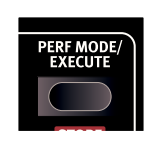
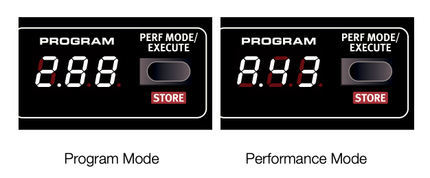
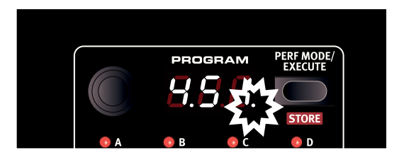
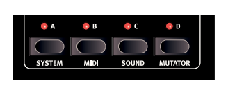
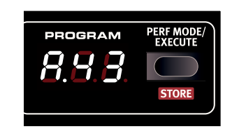
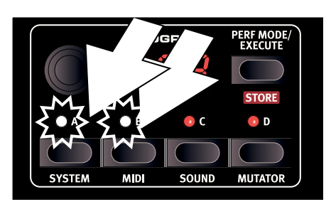
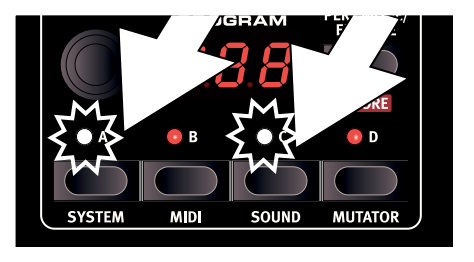
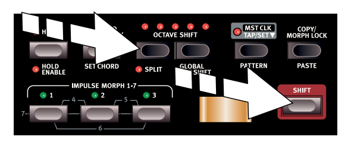

# 시작하기
## 사운드
노드 리드 4에는 완성된 사운드 설정이 프로그램과 퍼포먼스로 메모리에 저장되어 있다.
프로그램은 396개, 퍼포먼스는 100개가 저장되어 있다.

프로그램은 패널에서 설정 할 수 있는 신디사이저의 모든 기능을 이용해 만들어진 소리다.
퍼포먼스는 한 번에 4개의 프로그램(사운드)으로 만들 수 있다.
Perf Mode 버튼을 눌러 프로그램 모드와 퍼포먼스 모드를 바꿀 수 있다.

프로그램은 화면에 1._1 - 1.99와 같이 표시된다. 4.99가 마지막 값이다.
퍼포먼스는 화면에 A 또는 b 같은 이니셜 다음에 1 부터 50까지 숫자가 표시된다.

프리셑 프로그램과 퍼포먼스도 마음대로 변경할 수 있다.
www.nordkeyboards.com 웹사이트나 Nord Lead 4 CD를 사용해서 처음에 들어 있던 설정을 사용할 수 있다.

### 프로그램 선택하기
1. 프로그램 모드 상태에서 프로그램 다이얼을 돌려 프로그램을 선택한다. 프로그램은 4개의 뱅크 안에 각각
99개의 프로그램이 들어 있다.
2. Shift 버튼을 누른 상태에서 프로그램 다이얼을 돌리면 뱅크를 변경할 수 있다. 뱅크는 1, 2, 3, 4가 있다.

### 프로그램 수정하기
프로그램 모드 상태에서 값을 변경하거나 버튼을 누르거나 노브를 돌려서 쉽게 프로그램을 수정할 수 있다.
프로그램 모드에서 노브의 방향은 현재 프로그램 상태를 반영하고 있지 않고 돌리면 그때 부터는 노브가 가리키는
값으로 바뀐다.

1. 프로그램 모드에서 프로그램을 선택하고 시험 삼아 Filter Freq 노브를 돌려본다.
돌릴 때 마다 파라미터 값은 화면에 표시된다.

프로그램이 변경되면 프로그램 번호 오른쪽 아래 쩜(.) 표시가 보인다. 이 표시는 프로그램이 변경되었는데
아직 저장이 되지 않았다는 표시다. 그래서 지금 사용하고 있는 프로그램은 Edit 버퍼라는 곳에 임시로 저장되어
있다는 것을 알 수 있다.

만약에 저장하지 않고 다른 프로그램을 선택하고 다시 돌아와도 이전에 설정된 값들은 다 없어지고 저장하기
전의 프로그램 상태로 남아있다.

### 프로그램 저장하기
만들어진 프로그램이 마음에 든다면 저장하고 싶을 것이다.
노드 리드4는 출고 당시에 메모리 보호 기능이 On으로 설정되어 출고 되기 때문에 시스템 메뉴에서 Off로 변경해야
저장할 수 있다.

1. Shift 버튼을 누른 채로 Slot A/System 버튼을 누른다. 프로그램 다이얼을 돌려 처음 설정 값인 "1.ON"을
선택한다.

2. Shift 버튼을 누른 채로 프로그램 다이얼을 돌려 "1.OF"를 선택한다.

메모리 보호 기능이 Off가 되었고 이제 저장할 수 있다.

3. Shift 버튼을 누른 채로 Perf Mode/Store 버튼을 누른다.

화면에 빤짝이면서 현재 프로그램 번호가 나온다.

4. 프로그램 다이얼을 돌려 저장하고 싶은 프로그램을 선택한다.

뱅크를 변경하려면 Shift를 누른 채로 프로그램 다이얼을 돌린다.

* 프로그램은 하나의 번호를 사용하기 때문에 이전 프로그램이 덮어 써진다. 따라서 저장을 할 때는 주의 해야한다.

5. Shift 버튼을 누른 채로 확인을 위해 Store를 2초 동안 누른다. 이제 선택한 프로그램의 번호에 기존 프로그램 대신
방금 저장한 프로그램을 사용할 수 있다.

노드 리드4가 출고 될 때 4번 뱅크는 비어 있는 상태다. 그래서 기존의 프로그램을 지우지 않고 여기에 저장할 수 있다.

* 만약 출고 당시의 설정으로 복구 하려면 노드 리드 사운드 매니저나 웹사이트에서 백업 파일을 받아 복구 할 수 있다.
복구 방법은 메뉴얼의 다른 부분에서 다룬다.

## 슬롯
노드 리드는 A, B, C, D 4개의 슬롯이 있다.

각 슬롯은 완성된 신디사이저 설정을 나타낸다. 슬롯은 소리를 레이어링 하거나 프로그램을 빠르게 전환 할 때 사용한다.
슬롯은 미디로 조정 할 수 있다.

1. 슬롯 A를 누른다. LED가 하나만 들어온다.

2. 키보드를 연주하고 프로그램 다이얼을 돌려 다른 프로그램을 선택한다.

3. 슬롯 B를 누른다. 슬롯 A 대신 슬롯 B에 LED가 들어온다.

4. 프로그램 다이얼을 돌려 슬롯 B에서 사용할 프로그램을 선택한다.

슬롯 A 버튼과 슬롯 B 버튼으로 프로그램 다이얼을 돌리지 않고도 프로그램을 빠르게 바꿀 수 있다.

### 퍼포먼스 선택하기
1. Perf Mode 버튼을 눌러 퍼포먼스 모드로 변경한다.

2. 프로그램 다이얼을 돌려 A.1 부터 b.50까지 100의 퍼포먼스를 선택할 수 있다. 돌려 보다보면 어떤 퍼포먼스는
몇 개의 슬롯으로 되어 있고 또 어떤 퍼포먼스는 키보드의 일부가 다른 소리를 내도록 분리되어 있는 것을 알 수 있다.

### 퍼포먼스 수정하기
프로그램을 수정하는 것처럼 퍼포먼스 수정하는 것도 간단한다. 그냥 노브를 돌리면 수정이 된다.
퍼포먼스는 한번에 4개의 프로그램을 사용할 수 있기 때문에 어떤 프로그램이 변경되는지 알아야 한다.
변경하려는 슬롯은 슬롯 LED에 깜빡이는 슬롯이다.

퍼포먼스의 프로그램을 변경하려면 슬롯 버튼을 누른 상태에서 프로그램 다이얼로 변경하면 된다.

여러 슬롯 버튼을 동시에 누르고 있으면 4개의 슬롯을 조합해서 선택할 수 있다.
두개 이상이 슬롯이 선택된 경우에는 저장이 안된 경우라도 퍼포먼스 효과를 만들 수 있다.

### 두개의 프로그램 레이어링
1. 슬롯 A 버튼을 누른 상태에서 슬롯 B 버튼을 누른다. 두개의 슬롯에 LED가 켜지고 두개의 프로그램을 사용할 수
있게 된다.

슬롯 화면에 두개의 LED가 깜빡인다.

다른 슬롯을 눌러 다른 슬롯으로 변경 할 수 있다.

### 스플릿 만들기
1. 슬롯 A와 슬롯 C를 누른다. 앞에 레이어링 예제를 했다면 슬롯 B가 없어질것이다.

2. Shift와 Split 버튼을 누른다. 스플릿은 각각 두개의 스롯에 할당 되는데 A와 B는 왼쪽에 C와 D는
오른쪽에 할당 된다.

### 스플릿 설정하기
Shift와 Split을 누른다. 화면에 노트 번호가 나온다. 버튼을 누른 상태에서 키보드를 연주하면 가장 낮은 키와
가장 높은키를 설정 할 수 있다.

### 퍼포먼스 저장하기

만든 슬롯 조합을 저장하려면 Shift를 누르고 Store를 한번 누른다. 퍼포먼스 모드를 활성화 하려면 Perf Mode를 누르고
Program 다이얼을 돌려 저장할 위치(A, b, xx)를 확인하고 Shift를 누른 상태로 Store를 한번 더 누른다.

* 퍼포먼스 뱅크 b에 있는 마지막 10개(b.41 - b.50)는 공장 출시 할때 비어 있다.

### Shift 편집
퍼포먼스 모드에서 4개 슬롯에 연속된 파라미터를 동시에 바꿀 수 있다. Shift를 누르고 노브를 돌리면 된다.

프로그램의 파라미터 값 관계는 어떤 값 하나가 최대 또는 최소 값이 되기 전에는 유지된다. 
Shift 편집은 Slot 전체에서 Morph 설정 편집이 동작한다.

### 퍼포먼스에서 프로그램 가져오기

1. 저장하려고 하는 프로그램이 슬롯에 있는지 확인한다.

2. Shift를 누른 상태에서 Store를 한번 누른다.

3. Shift 버튼을 때고 퍼포먼스 모드에서 프로그램 모드로 전환하기 위해 Perf Mode 버튼을 누른다.

4. 프로그램 다이얼을 돌려서 저장하려고 하는 프로그램 위치를 선택한다.

5. Shift를 누른 상태로 저장을 확인하기 위해 Store를 누른다.

### 설정 복사하고 붙여넣기

한 슬롯에 있는 설정은 가상의 클립보드에 복사하고 다른 슬롯에 붙여 넣을 수 있다. 이 기능은 분리된 설정에서 아래 파트(A,B) 설정을
윗 파트(C,D)로 이동 하거나 퍼포먼스에 있는 프로그램을 다른 곳으로 복사할 때 유용하다.

1. 복사하려고 하는 슬롯을 확인한다.

2. Copy를 누른 상태로 복사하려는 슬롯 버튼을 누른다. 복사된 슬롯이 화면에 "cP" 라고 표시된다.

3. 이제 다이얼을 돌려 붙여넣을 퍼포먼스를 선택한다.

4. Shift와 Paste를 누른 상태로 붙여 넣을 슬롯 버튼을 누른다. 화면에 붙여넣을 슬롯과 "Ps" 글자가 표시된다. 
   설정이 퍼포먼스 편집 버퍼에 복사되어 화면 오른쪽에 점이 표시된걸 볼 수 있다.

가상의 클립보드에 복사된 내용은 다른 설정이 복사될 되거나 전원을 끌 때까지 남아 있다. 그래서 같은 설정을 다른 곳에 여러번 붙여 넣기 
할 수 있다. 

* 복사해서 만든 새로운 설정을 계속 유지하려면 프로그램이나 퍼포먼스를 저장하는 것을 잊지 말자.

개별 설정을 복사하는 것도 같은 방법으로 할 수 있다.

1. Copy를 누른 상태로 노브를 돌리면 복사가 된다. 값은 화면에 표시된다.

2. Paste 버튼을 누른다. 그리고 붙여넣을 대상에 다른 노브를 돌린다. 그러면 붙여넣을 대상에 복사가 된다.

* 복사/붙여넣기는 프로그램 간에 Morph, Impulse Morph 복사에 사용할 수 있다.

## 미디

노드 리드 4는 USB 미디 인터페이스를 사용해 글로벌 미디 채널1번으로 주고 받는 것으로 설정되어 있다. 연주할 때 미디 노트들은 채널1으로 
보내지고 채널1로 들어오는 입력으로 현재 프로그램 또는 퍼포먼스로 연주된다. 

패널의 버튼이나 노보를 돌릴 때 CC 데이터는 선택된 슬롯으로 전송되거나 수신된다.

미디 관련 설정은 미디 메뉴에 있다. 더 자세한 내용은 미디 호환성을 참고하면 된다.

### multitimbrality

미디 메뉴에서 슬롯 별 미디 설정을 하면 슬롯 별 미디 제어도 가능하다. 
